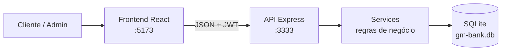

# G&M Bank

**Banco digital full-stack** construído como projeto de portfólio e aprendizado, com domínio próximo a um sistema financeiro corporativo: contas, PIX, TED, cartões, crédito (Tabela Price), investimentos, extrato, segurança (JWT/MFA) e painel administrativo.

> Inspirado na experiência de bancos digitais como Nubank, Inter e C6 — com foco em **regras de negócio**, **arquitetura em camadas** e **documentação auditável**.

---

## O que este projeto demonstra

| Competência | Como aparece no G&M Bank |
|-------------|--------------------------|
| Backend REST tipado | Express + TypeScript, contrato de rotas em português |
| Modelagem de domínio | 11 tabelas mínimas + auxiliares (auditoria, MFA, dispositivos) |
| Regras financeiras | Saldo, Price, Luhn, chaves PIX, limites por CPF |
| Segurança | bcrypt, JWT, MFA, lockout, logs de acesso |
| Frontend de produto | React + Vite, fluxos autenticados e painel admin |
| Qualidade de entrega | Diagrama, API documentada, guia passo a passo |

---

## Stack

```text
React 19 + Vite + TypeScript     →  Interface (SPA)
Express 5 + TypeScript           →  API REST
SQLite (node:sqlite)             →  Persistência local
JWT + bcrypt + Zod               →  Auth / validação
```

Detalhamento completo: [docs/01-arquitetura-e-tecnologias.md](docs/01-arquitetura-e-tecnologias.md)

---

## Arquitetura (visão rápida)



Documentação completa com diagramas C4, sequência e ER: pasta [`docs/`](docs/).

---

## Módulos entregues (1–10)

1. **Cadastro** — PF, CPF único, ≥18 anos, documentos, login, reset de senha  
2. **Contas** — corrente/poupança, agência `0001`, número automático  
3. **PIX** — chaves, envio, consulta, extrato  
4. **Transferências** — TED + interna + auditoria  
5. **Cartões** — virtual/físico, Luhn, PIN, bloqueio  
6. **Empréstimos** — simulação Price, solicitação, aprovação, parcelas  
7. **Investimentos** — CDB, poupança, Tesouro  
8. **Extrato** — unificado, filtro, CSV/PDF  
9. **Segurança** — JWT, MFA, dispositivos, lockout  
10. **Admin** — dashboard operacional  

Passo a passo de cada módulo: [docs/04-modulos-e-regras.md](docs/04-modulos-e-regras.md)

---

## Contrato de API (principais)

| Método | Rota | Descrição |
|--------|------|-----------|
| `POST` | `/clientes` | Cadastro |
| `POST` | `/login` | Login cliente ou admin |
| `POST` | `/contas` | Abrir conta |
| `POST` | `/pix/enviar` | Enviar PIX |
| `POST` | `/transferencia` | TED ou interna |
| `POST` | `/emprestimo` | Solicitar crédito |
| `GET` | `/extrato` | Movimentações |
| `GET` | `/dashboard` | Painel admin |

API detalhada: [docs/03-api-e-contrato.md](docs/03-api-e-contrato.md)

---

## Como rodar

```bash
# API — http://localhost:3333
cd backend
npm install
npm run dev

# Frontend — http://localhost:5173
cd frontend
npm install
npm run dev
```

Guia completo (env, admin, dados de teste): [docs/07-guia-local.md](docs/07-guia-local.md)

**Admin padrão:** `admin@gmbank.local` / `Admin@123`

---

## Documentação

| Documento | Conteúdo |
|-----------|----------|
| [01 — Arquitetura e tecnologias](docs/01-arquitetura-e-tecnologias.md) | Camadas, stack, decisões técnicas |
| [02 — Banco de dados](docs/02-banco-de-dados.md) | Modelo ER, tabelas, relacionamentos |
| [03 — API e contrato](docs/03-api-e-contrato.md) | Endpoints, payloads, autenticação |
| [04 — Módulos e regras](docs/04-modulos-e-regras.md) | Passo a passo funcional |
| [05 — Fluxos e diagramas](docs/05-fluxos-e-diagramas.md) | Sequências (login, PIX, crédito) |
| [06 — Segurança](docs/06-seguranca.md) | JWT, MFA, lockout, auditoria |
| [07 — Guia local](docs/07-guia-local.md) | Setup, credenciais, troubleshooting |

---

## Estrutura do repositório

```text
banco-gm/
├── backend/          # API Express + SQLite
│   └── src/
│       ├── routes/       # HTTP (contrato PT + recursos)
│       ├── services/     # Regras de negócio
│       ├── db/           # Schema + migrações
│       ├── middleware/   # JWT / admin
│       └── utils/        # CPF, senha, idade, Zod
├── frontend/         # SPA React
│   └── src/
│       ├── pages/        # Telas por domínio
│       ├── auth/         # Contexto JWT
│       └── lib/api.ts    # Cliente HTTP
└── docs/             # Documentação corporativa
```

---

## Roadmap (próximos passos reais)

- Cobrança automática de parcelas de empréstimo  
- Resgate de investimentos  
- Ambientes (dev/homolog/prod) e PostgreSQL  
- Testes automatizados (unit + e2e)  
- Observabilidade (métricas / tracing)

---

**G&M Bank** — portfólio de arquitetura de fintech digital.
