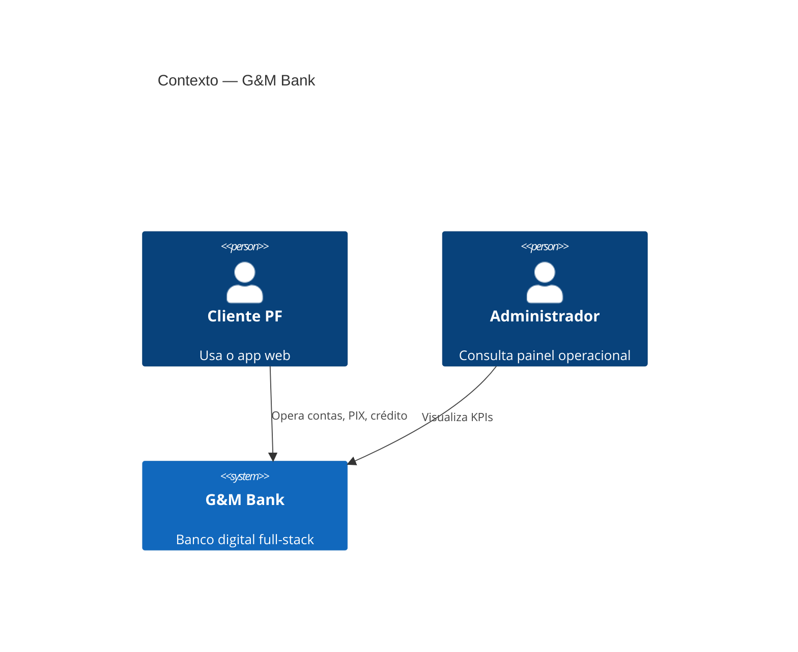
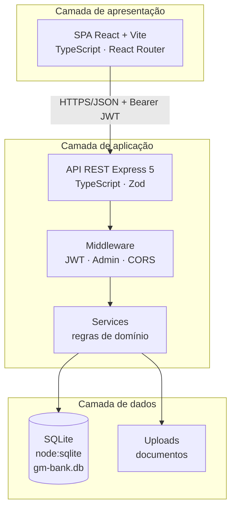
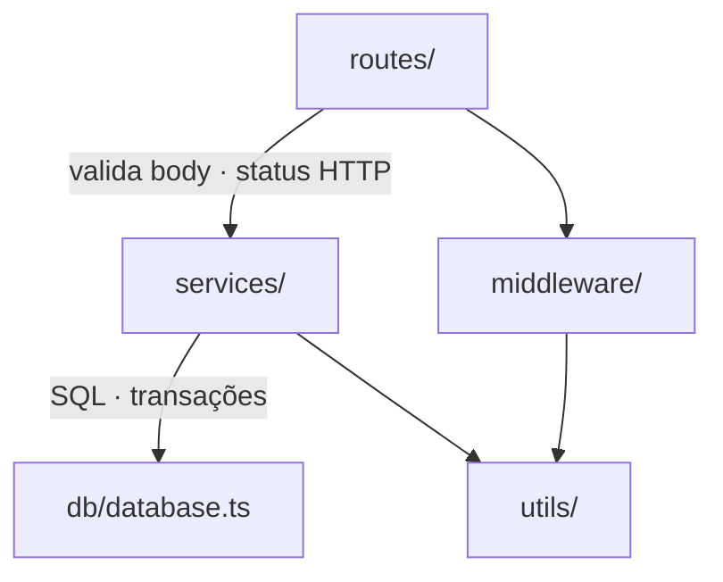

# 01 — Arquitetura e tecnologias

## 1. Contexto do sistema

O **G&M Bank** é um banco digital de estudo que cobre o ciclo completo de um cliente PF: cadastro → abertura de contas → movimentações (PIX/TED) → cartões → crédito → investimentos → extrato → administração.



> Se o diagrama C4Context não renderizar no seu viewer, use a visão de containers abaixo (Mermaid clássico).

## 2. Visão de containers



## 3. Camadas internas (backend)

Arquitetura em **camadas**, separando transporte HTTP de regras de negócio:



| Pasta | Responsabilidade | Exemplos |
|-------|------------------|----------|
| `routes/` | Contrato HTTP, parsing, códigos de status | `contrato.ts`, `pix.ts` |
| `services/` | Regras de negócio e orquestração | `pixService`, `loanService` |
| `db/` | Schema, migrações, helpers de persistência | `database.ts` |
| `middleware/` | Autenticação e autorização | `auth.ts` |
| `utils/` | CPF, idade, senha, JWT, Zod schemas | `cpf.ts`, `validators.ts` |

Essa separação espelha o padrão **Controller → Service → Repository** usado em sistemas corporativos (mesmo sem ORM).

## 4. Stack detalhada

### Frontend

| Tecnologia | Versão (aprox.) | Papel |
|------------|-----------------|-------|
| React | 19 | UI componentizada |
| Vite | 8 | Bundler / HMR |
| TypeScript | 6 | Tipagem estática |
| React Router | 7 | Rotas SPA (`/app`, `/pix`, `/admin`…) |

O cliente HTTP vive em `frontend/src/lib/api.ts` e consome o **contrato em português**.

### Backend

| Tecnologia | Papel |
|------------|-------|
| Node.js | Runtime |
| Express 5 | Servidor HTTP / routers |
| TypeScript + `tsx` | Linguagem + execução em dev |
| Zod | Validação de entrada |
| bcryptjs | Hash de senha e PIN |
| jsonwebtoken | Emissão/validação JWT |
| multer | Upload de documentos |
| dotenv | Variáveis de ambiente |
| CORS | Origem permitida do frontend |

### Persistência

| Tecnologia | Papel |
|------------|-------|
| SQLite via `node:sqlite` (`DatabaseSync`) | Banco embutido, zero setup externo |
| Migrations inline | Rename EN→PT, backfill de parcelas, etc. |

**Por que SQLite neste portfólio?** simplicidade de demo, portabilidade e foco nas regras. Em produção corporativa, o mesmo desenho de services migraria para PostgreSQL com pouco atrito.

## 5. Decisões técnicas (ADRs resumidos)

| Decisão | Motivo | Trade-off |
|---------|--------|-----------|
| Contrato de API em PT | Legibilidade didática e alinhamento ao domínio BR | Menos “REST inglês” convencional |
| Centavos no banco | Evita erro de ponto flutuante em dinheiro | Conversão na borda da API |
| Services sem ORM | SQL explícito, fácil de auditar | Mais código boilerplate |
| JWT no localStorage (SPA) | Simplicidade de demo | Em produção: HTTP-only cookie + refresh |
| Admin em `usuarios_admin` | Separação clara de papéis | Dois modelos de autenticação |

## 6. Estrutura de pastas (mapa)

```text
backend/src/
├── index.ts              # bootstrap, mounts PT + /api legadas
├── routes/
│   ├── contrato.ts       # POST /clientes, /login, /pix/enviar…
│   ├── accounts.ts       # /contas
│   ├── pix.ts            # /pix/*
│   └── …
├── services/             # domínio
├── db/database.ts        # schema + extratos + migrações
├── middleware/auth.ts
└── utils/

frontend/src/
├── App.tsx               # rotas
├── auth/AuthContext.tsx  # sessão JWT
├── lib/api.ts            # cliente REST
├── pages/                # telas por módulo
└── components/
```

## 7. Ambientes e portas

| Serviço | URL padrão |
|---------|------------|
| Frontend | http://localhost:5173 |
| API | http://localhost:3333 |
| Health | `GET /health` |

Variáveis típicas (`backend/.env`):

```env
PORT=3333
FRONTEND_URL=http://localhost:5173
JWT_SECRET=troque-em-producao
```

## 8. Qualidade e evolução

Já presente:

- Validação de entrada (Zod)  
- Erros de domínio (`AppError` com status)  
- Transações SQL em fluxos críticos (ex.: aprovação de empréstimo)  
- Logs de acesso e auditoria de transferências  

Próximo nível corporativo:

- Testes (Jest/Vitest + Playwright)  
- CI/CD  
- OpenAPI gerado a partir do contrato  
- Observabilidade (request-id, métricas)
