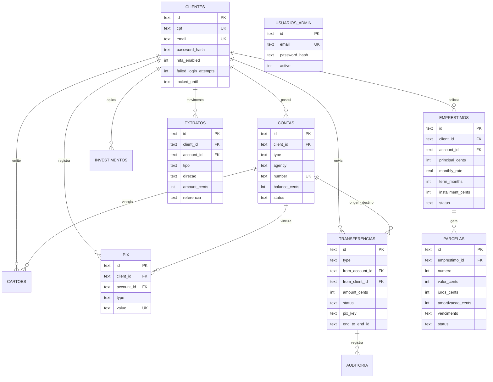

# 02 — Banco de dados

## 1. Visão geral

Persistência em **SQLite** (`backend/data/gm-bank.db`), criada e migrada em runtime por `backend/src/db/database.ts`.

Valores monetários: **`*_cents` (INTEGER)** — a API converte para reais na resposta.

## 2. Tabelas mínimas (contrato do domínio)

| Tabela | Domínio |
|--------|---------|
| `clientes` | Cadastro PF |
| `contas` | Conta corrente / poupança |
| `cartoes` | Cartão virtual / físico |
| `pix` | Chaves PIX |
| `transferencias` | TED, interna e PIX (movimentos) |
| `emprestimos` | Solicitação e crédito |
| `parcelas` | Cronograma Price |
| `investimentos` | CDB / poupança / Tesouro |
| `extratos` | Ledger de movimentações |
| `auditoria` | Trilha de auditoria |
| `usuarios_admin` | Operadores |

### Auxiliares (suporte operacional)

| Tabela | Uso |
|--------|-----|
| `documentos` | Upload de identidade |
| `password_resets` | Tokens de reset |
| `access_logs` | Logs de autenticação |
| `devices` | Dispositivos conhecidos |
| `mfa_challenges` | Desafios MFA |
| `contas_sequencias` | Sequência do número da conta |

## 3. Diagrama entidade-relacionamento



## 4. Relacionamentos e restrições importantes

### Contas
- `UNIQUE (client_id, type)` → no máximo 1 corrente e 1 poupança por CPF.  
- `balance_cents >= 0`.  
- Status: `active | blocked | closed`.

### PIX (chaves)
- `UNIQUE (client_id, type)` → uma chave de cada tipo.  
- `value` único no banco.  
- Movimentos PIX ficam em `transferencias` (`type = 'pix'`) **e** em `extratos`.

### Transferências
- Tipos: `ted | internal | pix`.  
- Status: `completed | failed`.  
- TED guarda dados do favorecido externo; interna resolve conta destino G&M.

### Empréstimos e parcelas
- Status do empréstimo: `pending | approved | …`.  
- Na aprovação: credita saldo + gera N linhas em `parcelas` (Tabela Price).

### Extratos
- Ledger append-only por cliente/conta.  
- `direcao`: `in | out`.  
- `referencia` aponta para o ID da operação de origem.

## 5. Modelo monetário

```text
R$ 1.234,56  →  123456 cents (banco)
API responde →  amount: 1234.56  e  amountCents: 123456
```

Evita acumulação de erro de `float` em cálculos financeiros.

## 6. Migrações

Na inicialização:

1. Renomeia tables legadas EN → PT (`clients` → `clientes`, …).  
2. Cria tabelas/índices se não existirem.  
3. Evolui `transferencias` para aceitar `type = 'pix'`.  
4. Copia `pix_transactions` legadas → `transferencias` + `extratos`.  
5. Backfill de `parcelas` para empréstimos já aprovados.  
6. Remove artefatos legados (`documents`, `pix_transactions`).

## 7. Índices de integridade (negócio)

```sql
UNIQUE contas (client_id, type);
UNIQUE cartoes (account_id, type);
UNIQUE pix (client_id, type);
```

## 8. Como inspecionar o banco

```bash
# Via script Node/tsx ou DB Browser for SQLite
# Arquivo: backend/data/gm-bank.db
```

Consultas úteis:

```sql
SELECT name FROM sqlite_master WHERE type='table' ORDER BY 1;
SELECT COUNT(*) FROM clientes;
SELECT type, COUNT(*) FROM transferencias GROUP BY type;
SELECT emprestimo_id, COUNT(*) FROM parcelas GROUP BY emprestimo_id;
```
