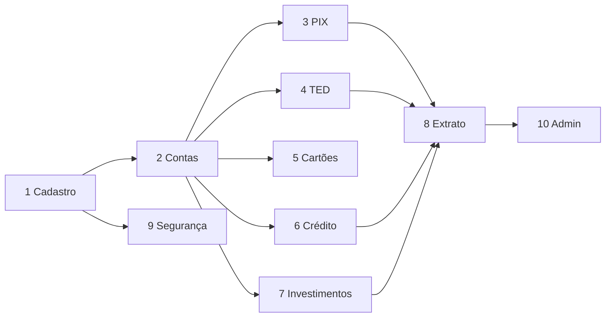

# 04 — Módulos e regras de negócio

Documentação **passo a passo** do que foi implementado em cada módulo, no estilo de um caderno de requisitos + entrega.

---

## Módulo 1 — Cadastro de clientes

### Objetivo
Onboarding de pessoa física com dados cadastrais, documentos e autenticação.

### Passos implementados
1. Formulário de cadastro no frontend (`RegisterPage`).  
2. Validação de CPF (dígitos verificadores) e idade ≥ 18.  
3. Hash de senha com **bcrypt** (12 rounds).  
4. Persistência em `clientes` + opcionalmente `documentos`.  
5. Emissão de JWT após cadastro.  
6. Login por CPF ou e-mail.  
7. Fluxo esqueci senha → token em `password_resets` → redefinição.

### Regras
| Regra | Implementação |
|-------|---------------|
| CPF único | `UNIQUE` + checagem no service |
| E-mail único | `UNIQUE` |
| Maioridade | util `age.ts` |
| Documento | JPG/PNG/PDF até 5 MB (multer) |

**Endpoint:** `POST /clientes`

---

## Módulo 2 — Contas bancárias

### Objetivo
Abrir e gerir contas da relação bancária.

### Passos
1. Criar conta corrente ou poupança.  
2. Agência fixa `0001`.  
3. Número sequencial + dígito verificador (`contas_sequencias`).  
4. Saldo inicial `0`.  
5. Status: ativa / bloqueada / encerrada.  
6. Depósito de teste (+R$ 100) para demos.

### Regras
- Máximo **1** conta de cada tipo por cliente.  
- Movimentações só em conta `active`.

**Endpoints:** `POST /contas` · `GET /contas`

---

## Módulo 3 — PIX

### Objetivo
Instant payment com chaves e transferências.

### Passos
1. Registrar chave (`cpf`, `phone`, `email`, `random`).  
2. Consultar destino (`/pix/lookup/:value`).  
3. Enviar PIX debitando origem / creditando destino.  
4. Gerar `end_to_end_id`.  
5. Registrar em `transferencias` + `extratos` (out/in).

### Regras
- Saldo suficiente.  
- Contas ativas.  
- Uma chave por tipo por cliente.  
- Chaves cadastrais derivadas dos dados do cliente.

**Endpoint principal:** `POST /pix/enviar`

---

## Módulo 4 — Transferências (TED / interna)

### Objetivo
Transferências clássicas com trilha de auditoria.

### Passos
1. Interna: resolve agência + conta G&M e move saldo.  
2. TED: debita origem e registra favorecido externo (simulado).  
3. Grava sucesso/falha em `auditoria`.  
4. Espelha movimento em `extratos`.

### Regras
- Validação de saldo antes do débito.  
- Body unificado em `POST /transferencia` com `type`.

**Endpoint:** `POST /transferencia`

---

## Módulo 5 — Cartões

### Objetivo
Emitir e gerir cartões virtuais/físicos.

### Passos
1. Gerar número (Luhn) + CVV + validade.  
2. PIN com bcrypt.  
3. Vincular à conta.  
4. Bloquear / desbloquear / trocar PIN.

### Regras
- 1 virtual + 1 físico por conta.  
- Operações respeitam status do cartão.

**Prefixo:** `/cartoes`

---

## Módulo 6 — Empréstimos (Tabela Price)

### Objetivo
Creditar capital com cronograma de parcelas.

### Fórmula (PMT)

\[
PMT = PV \times \frac{i(1+i)^n}{(1+i)^n - 1}
\]

Parâmetros padrão: **PV = R$ 10.000**, **i = 2% a.m.**, **n = 24**.

Resultado esperado (arredondamento bancário em centavos):

| Métrica | Valor aproximado |
|---------|------------------|
| Parcela | R$ 528,71 |
| Juros totais | R$ 2.689,04 |
| Total pago | R$ 12.689,04 |

### Passos
1. Simular (`/emprestimos/simulate`).  
2. Solicitar (`POST /emprestimo`) → status `pending`.  
3. Aprovar → credita conta, gera 24 `parcelas`, grava extrato.

**Endpoint:** `POST /emprestimo`

---

## Módulo 7 — Investimentos

### Objetivo
Aplicações com simulação de juros compostos.

### Produtos
| Produto | Mínimo | Taxa (demo) |
|---------|--------|-------------|
| CDB | R$ 100 | configurável no service |
| Poupança | R$ 50 | … |
| Tesouro | R$ 30 | … |

Fórmula: \( Valor \times (1 + i)^n \).

Débito da conta + registro em `investimentos` + `extratos`.

**Prefixo:** `/investimentos`

---

## Módulo 8 — Extrato

### Objetivo
Visão unificada do ledger do cliente.

### Passos
1. Agregar de `extratos` (PIX, TED, interna, depósito, crédito, aplicação…).  
2. Filtrar por `from` / `to`.  
3. Exportar CSV ou PDF.

**Endpoint:** `GET /extrato`

---

## Módulo 9 — Segurança

Ver [06-seguranca.md](06-seguranca.md). Resumo:

- JWT  
- MFA 6 dígitos  
- Lockout 5 falhas / 15 min  
- Logs + dispositivos  

---

## Módulo 10 — Administração

### Objetivo
Painel operacional para `usuarios_admin`.

### KPIs
- Total de clientes e contas  
- Volume PIX e TED  
- Empréstimos ativos  
- Receita estimada (juros de crédito + proxy sobre volume investido)

**Endpoint:** `GET /dashboard`  
**Login:** `admin@gmbank.local` / `Admin@123`

---

## Ordem sugerida de leitura / implementação

Essa ordem reflete dependências reais: sem conta não há movimento; sem movimentos o extrato é vazio; o admin consome agregados de tudo.
