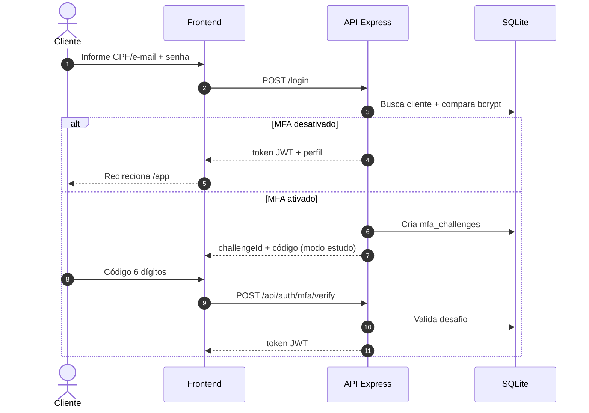
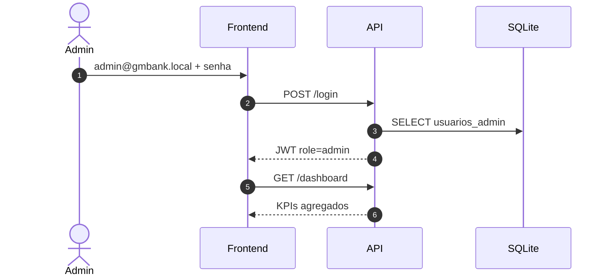
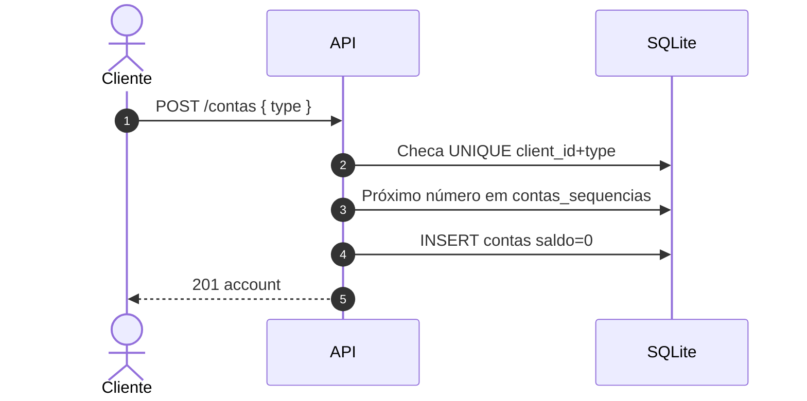
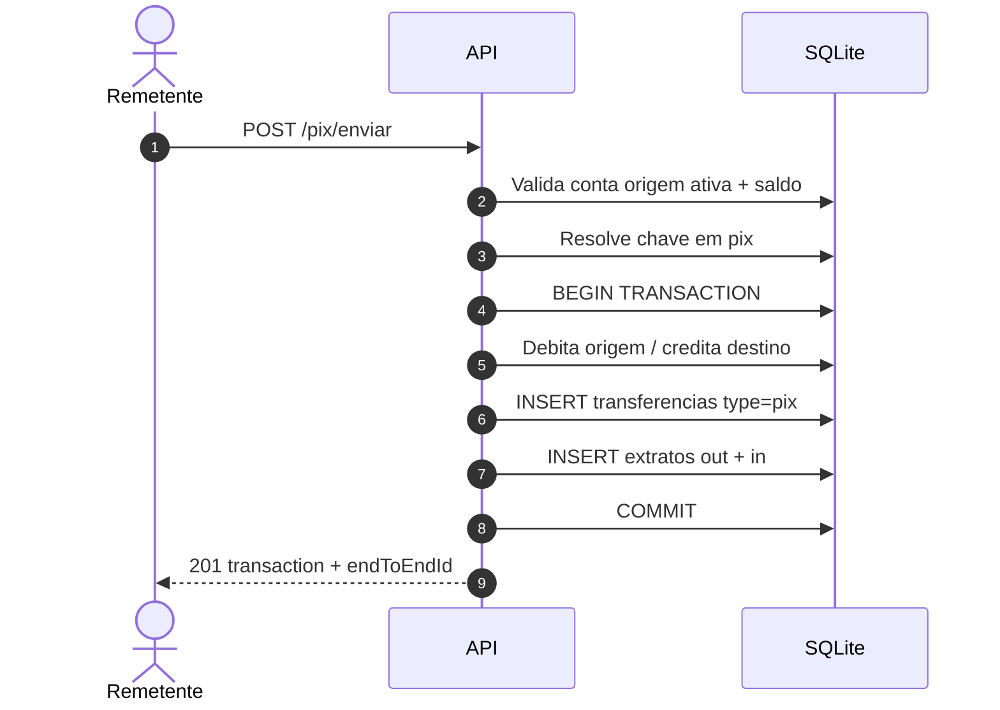
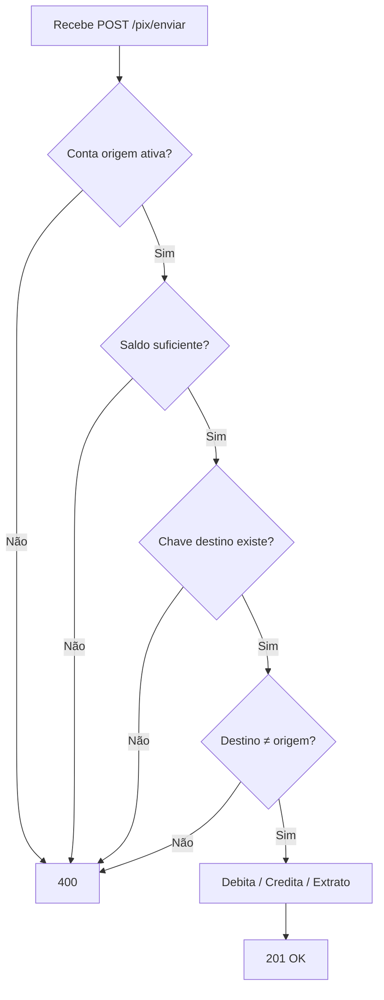
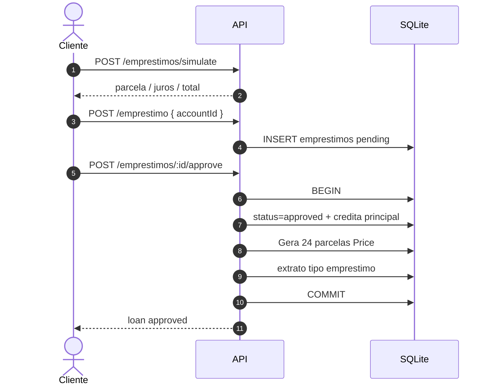
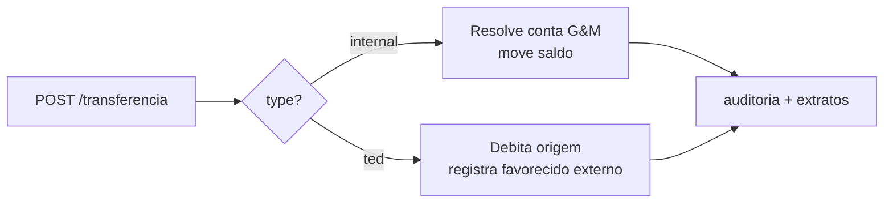
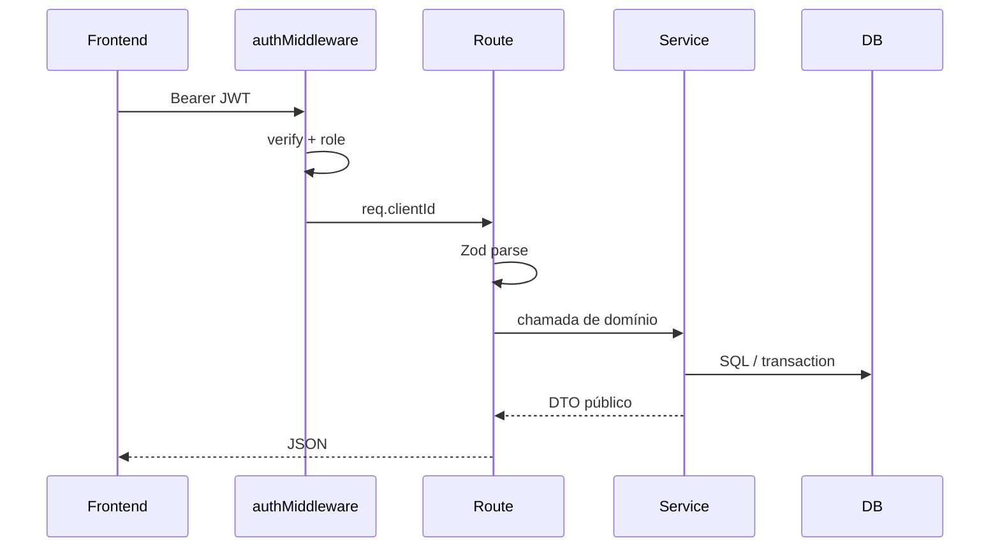

# 05 — Fluxos e diagramas

Diagramas de sequência e fluxo alinhados a um processo de negócio corporativo.

---

## 1. Login (cliente) e MFA



---

## 2. Login admin



---

## 3. Abertura de conta



---

## 4. PIX — envio ponta a ponta





---

## 5. Empréstimo — da simulação ao crédito



### Decomposição Price (parcela n)

```text
juros_n       = saldo_devedor × i
amortizacao_n = PMT − juros_n
saldo_n+1     = saldo_n − amortizacao_n
```

Persistido em `parcelas` para auditoria e cobrança futura.

---

## 6. Transferência unificada



---

## 7. Visão de navegação do frontend

```mermaid
flowchart TB
  HOME[/] --> LOGIN[/login]
  HOME --> REG[/register]
  LOGIN -->|client| APP[/app]
  LOGIN -->|admin| ADM[/admin]
  APP --> PIX[/pix]
  APP --> TED[/transferencias]
  APP --> CARD[/cartoes]
  APP --> LOAN[/emprestimos]
  APP --> INV[/investimentos]
  APP --> EXT[/extrato]
  APP --> SEC[/seguranca]
```

---

## 8. Pipeline de uma requisição autenticada



Esse pipeline é o mesmo padrão visto em APIs bancárias e fintechs: **autenticação → validação → domínio → persistência → resposta**.
