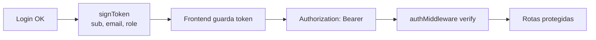
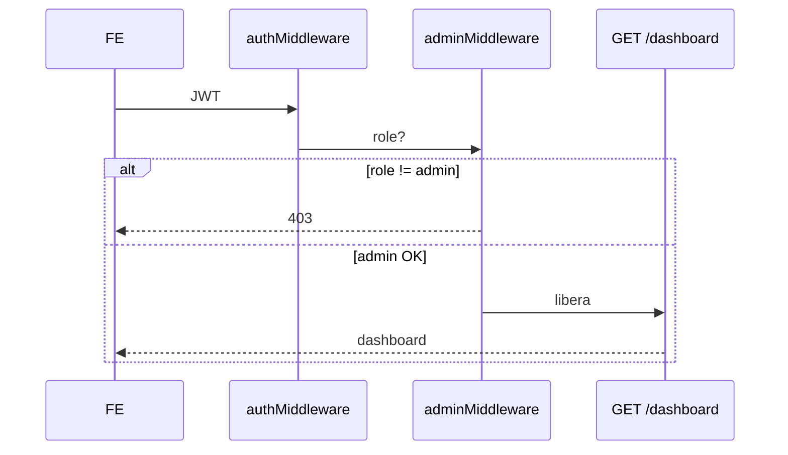

# 06 — Segurança

Documento no estilo de um briefing de segurança de aplicação (AppSec) para portfólio.

---

## 1. Objetivos de controle

| Objetivo | Controles no G&M Bank |
|----------|------------------------|
| Confidencialidade de credenciais | bcrypt (senha e PIN) |
| Autenticação de sessão | JWT assinado |
| Autorização | `role` client/admin + `adminMiddleware` |
| Integridade de operações | Transações SQL + auditoria |
| Disponibilidade ante brute-force | Lockout após 5 falhas |
| Rastreabilidade | `access_logs`, `auditoria`, `devices` |
| MFA | Desafio de 6 dígitos |

---

## 2. Autenticação (JWT)

- Segredo via `JWT_SECRET` (env).  
- Payload mínimo: identidade + papel.  
- Admin autenticado pela tabela `usuarios_admin` (separada de `clientes`).

---

## 3. Hash de senha

- Algoritmo: **bcrypt**.  
- Custo: **12 rounds** (bom equilíbrio demo/segurança).  
- PIN de cartão também hasheado (nunca em texto puro).

---

## 4. MFA (segundo fator)

1. Cliente ativa MFA em `/seguranca`.  
2. No login, se `mfa_enabled`, a API **não** devolve o JWT final.  
3. Cria registro em `mfa_challenges` (código hasheado + expiração).  
4. Em **modo estudo**, o código também retorna em JSON (`mfaCode`) para facilitar demos.  
5. `POST /api/auth/mfa/verify` valida e emite JWT.

> Em produção corporativa o código iria por SMS/TOTP/e-mail — nunca na resposta da API.

---

## 5. Lockout de login

| Parâmetro | Valor |
|-----------|-------|
| Tentativas máximas | 5 |
| Janela de bloqueio | 15 minutos |
| Campos | `failed_login_attempts`, `locked_until` |

Evita ataques de senha por força bruta no endpoint `/login`.

---

## 6. Logs e dispositivos

### Access logs
- Ações: `auth.login`, `auth.register`, `auth.login.admin`, MFA, etc.  
- Guarda IP, user-agent, sucesso/falha.  
- Admin **não** grava `client_id` inválido (FK) — usa `null` + detalhes.

### Devices
- Upsert por user-agent após login bem-sucedido.  
- Permite ao cliente ver “onde entrei”.

### Auditoria de transferências
- Sucesso e falha em `auditoria` (complementa o ledger `extratos`).

---

## 7. Autorização admin

---

## 8. Validação de entrada

- **Zod** em rotas sensíveis (valores, UUIDs, enums).  
- Upload filtrado por MIME + limite de tamanho.  
- CPF e maioridade validados no domínio.

---

## 9. Superfície de ataque (consciência)

| Risco | Mitigação atual | Melhoria corporativa |
|-------|-----------------|----------------------|
| Token no storage do SPA | Demo ok | Cookie HTTP-only + refresh rotation |
| MFA code na resposta | Modo estudo | Canal out-of-band |
| SQLite local | Portabilidade | Postgres + backups + TLS |
| CORS aberto a origem fixa | `FRONTEND_URL` | Lista por ambiente |
| Segredo JWT default | Env | Vault / KMS |

---

## 10. Checklist de demo segura

- [ ] Trocar `JWT_SECRET` antes de expor a rede  
- [ ] Não commitando `.env` / `*.db` com dados reais  
- [ ] Admin password apenas em ambiente local  
- [ ] Desativar retorno de `mfaCode` se publicar publicamente  
