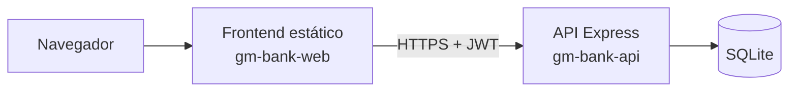

# 08 — Deploy online (Render)

Guia para colocar o **G&M Bank** na internet com link público para testar e compartilhar no LinkedIn.

Plataforma escolhida: **[Render](https://render.com)** (plano free).

---

## Como funciona

Dois serviços:

| Serviço | O que é |
|---------|---------|
| `gm-bank-api` | Backend Node/Express |
| `gm-bank-web` | Frontend React (build Vite) |

> **Atenção (free):** o serviço “dorme” após ~15 min sem uso. A 1ª abertura pode demorar 30–60s. O SQLite no free **não é persistente** entre redeploys (dados de teste podem zerar).

---

## Passo a passo (painel do Render)

### 1. Conta
1. Acesse https://render.com  
2. Entre com a conta **GitHub** (`gelvano73`)  
3. Autorize o acesso ao repo `banco-gm`

### 2. Criar a API
1. **Dashboard → New → Web Service**  
2. Conecte o repositório `gelvano73/banco-gm`  
3. Configure:

| Campo | Valor |
|-------|--------|
| Name | `gm-bank-api` |
| Root Directory | `backend` |
| Runtime | Node |
| Build Command | `npm install` |
| Start Command | `npm start` |
| Instance | Free |

4. **Environment**:

| Key | Value |
|-----|--------|
| `NODE_ENV` | `production` |
| `JWT_SECRET` | (Generate / senha longa aleatória) |
| `FRONTEND_URL` | deixe temporário `*` ou preencha depois com a URL do front |

5. **Create Web Service** e aguarde o deploy (verde / Live).  
6. Copie a URL, ex.: `https://gm-bank-api.onrender.com`  
7. Teste: `https://gm-bank-api.onrender.com/health`

### 3. Criar o Frontend
1. **New → Static Site**  
2. Mesmo repo `banco-gm`  
3. Configure:

| Campo | Valor |
|-------|--------|
| Name | `gm-bank-web` |
| Root Directory | `frontend` |
| Build Command | `npm install && npm run build` |
| Publish Directory | `dist` |

4. **Environment** (no build):

| Key | Value |
|-----|--------|
| `VITE_API_URL` | `https://gm-bank-api.onrender.com` ← URL da API do passo 2 |

5. Em **Redirects/Rewrites** (SPA), adicione:
   - Source: `/*`  
   - Destination: `/index.html`  
   - Action: **Rewrite**

6. **Create Static Site** e aguarde.  
7. Copie a URL do front, ex.: `https://gm-bank-web.onrender.com`

### 4. Ligar CORS
1. Volte em **gm-bank-api → Environment**  
2. Ajuste:

| Key | Value |
|-----|--------|
| `FRONTEND_URL` | `https://gm-bank-web.onrender.com` |

3. Salve → o Render faz redeploy da API.

### 5. Testar
1. Abra a URL do **frontend**  
2. Cadastre um cliente ou use admin:  
   - `admin@gmbank.local` / `Admin@123`  
3. Se a 1ª carga falhar, espere 1 minuto (API “acordando”) e atualize.

---

## Alternativa: Blueprint (`render.yaml`)

1. No Render: **New → Blueprint**  
2. Selecione o repo `banco-gm` (arquivo `render.yaml` na raiz)  
3. Aplique o blueprint  
4. Preencha `VITE_API_URL` e `FRONTEND_URL` como acima e redeploy

---

## LinkedIn / portfólio

Depois de no ar, use:

- **Código:** https://github.com/gelvano73/banco-gm  
- **Demo online:** `https://gm-bank-web.onrender.com` (sua URL real)

Texto sugerido:

> G&M Bank — banco digital full-stack (React + Express + SQLite).  
> Demo: [link do Render] · Código: [link do GitHub]

---

## Problemas comuns

| Sintoma | Solução |
|---------|---------|
| Front abre, login falha (CORS) | `FRONTEND_URL` = URL exata do static site |
| Front chama localhost | Rebuild do front com `VITE_API_URL` da API |
| Timeout na 1ª request | Espere a API acordar (free) e tente de novo |
| Dados sumiram | Normal no free após redeploy; SQLite efêmero |

---

## Próximo nível (opcional)

- Disco persistente no Render para o SQLite  
- Domínio customizado  
- PostgreSQL em vez de SQLite  
